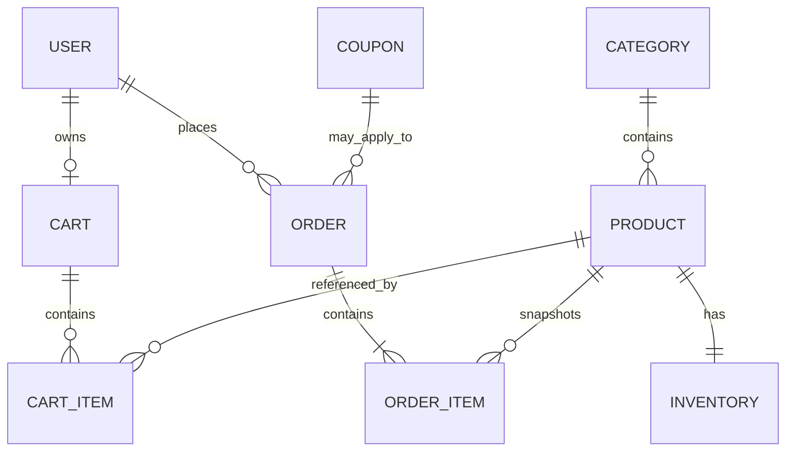

# 05 - Database Design

## Candidate entities
- User
- Role
- Product
- Category
- Inventory
- Cart
- CartItem
- Order
- OrderItem
- Coupon

The exact fields are finalized while learning JPA in Week 5; do not blindly generate all entities on day one.

## Relationship concept

## Constraints to consider
- unique user login identifier/email as selected by requirements,
- unique SKU if used,
- non-negative product price,
- non-negative stock,
- positive cart/order item quantity,
- foreign keys,
- unique cart-item product per cart if that matches service behavior.

## Index candidates
Do not add indexes blindly. Likely candidates include user login field, product SKU, product/category lookup, order customer/date, and fields used by real search/filter queries.

## Transactions
Checkout and cancellation are transaction-sensitive. Database constraints complement service validation; they do not replace authorization/business logic.

## Historical integrity
OrderItem should preserve product name/identifier and purchase price data needed to display a historical order even if catalog data changes later.
