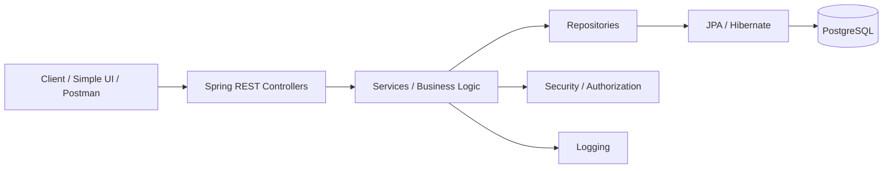
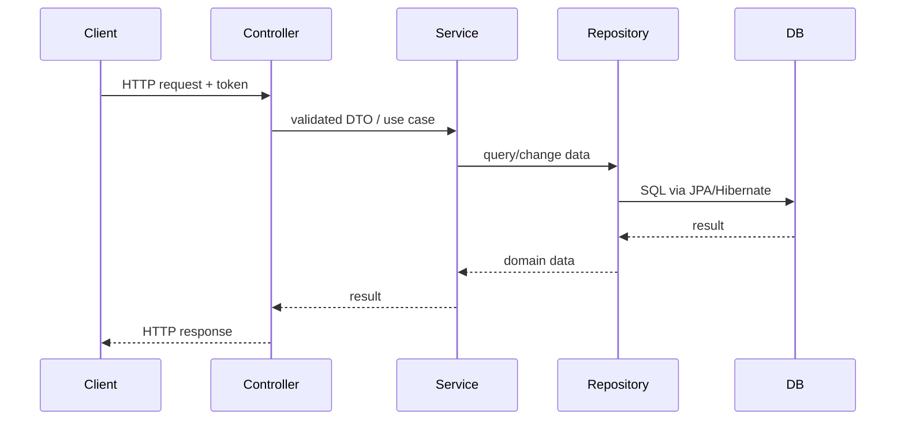
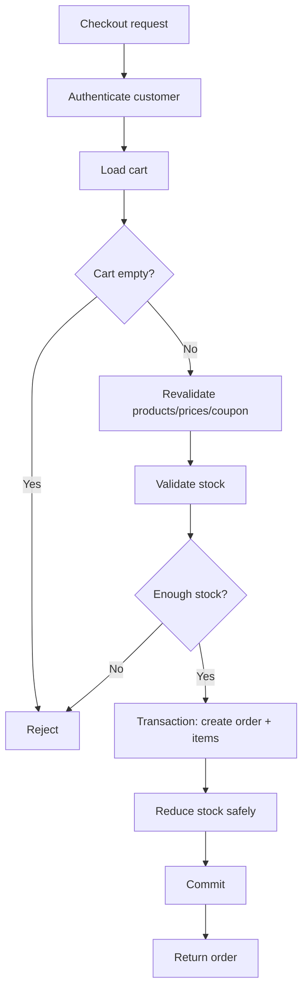
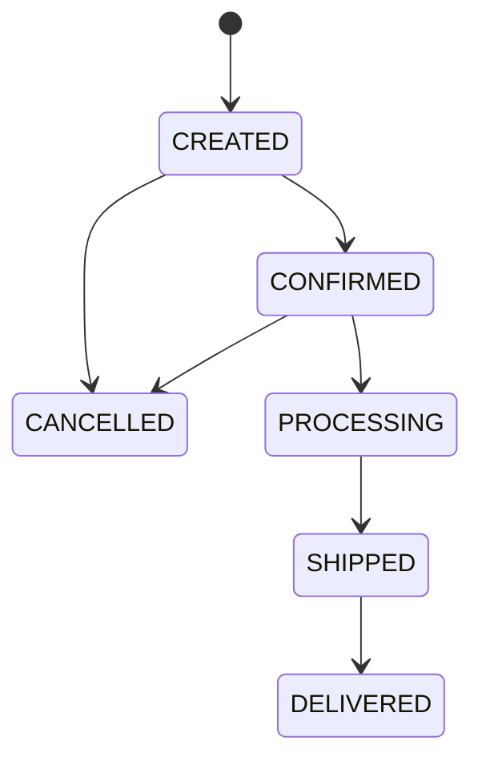

# 07 - Architecture

## Style
Modular monolith. We intentionally avoid microservices in v1.

## Request flow

## Package direction
Suggested later:
- controller
- dto
- service
- repository
- entity
- security
- exception
- config

Do not create empty abstraction layers just to match a diagram. Introduce them when their responsibilities are understood.

## Checkout flow

## Order lifecycle

The final allowed transitions are a business decision and must be tested.
