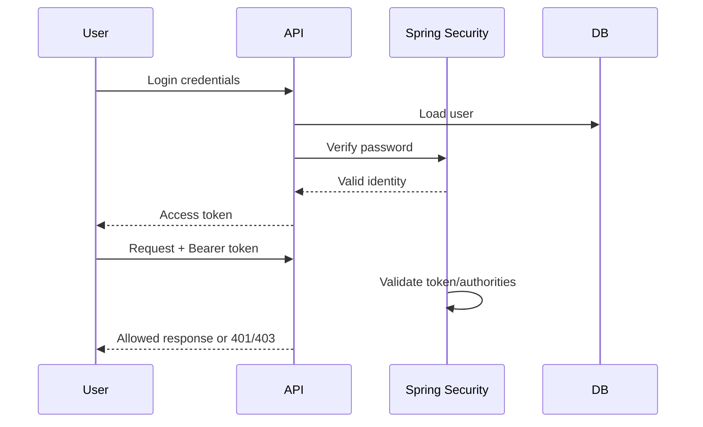

# 08 - Security

## Concepts to learn
Authentication answers "Who are you?" Authorization answers "What may you do?"

## Planned controls
- Spring Security
- secure password hashing
- JWT-based API authentication
- CUSTOMER and ADMIN roles initially
- server-side role checks
- DTO validation
- secrets via environment/configuration, never committed

## Rules
- Public registration cannot create Admin accounts.
- Customer cannot call Admin catalog/inventory endpoints.
- Customer cannot read/modify another customer's cart/orders.
- Never trust price, total, role, or ownership supplied by client.
- Do not log passwords, tokens, secrets, or unnecessary personal data.
- JWT does not make data trustworthy by itself; authorization and business checks still happen server-side.
- Use HTTPS in deployed environments.

## Authentication flow

Exact JWT lifetime/refresh strategy is selected when Security is implemented, not invented prematurely.
