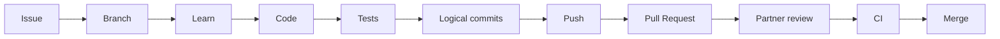

# 09 - GitHub Workflow for Two Developers

## Initial repository push
The starter documentation may be committed once to `main` as the initial repository state. After that, normal feature work does not happen directly on `main`.

## Daily feature flow

## Issue sizing
An Issue represents a clear testable deliverable, not a fixed number of days.
- Small: roughly 2-4 focused implementation hours
- Medium: half to one focused day
- Large: 1-2 focused days
- Larger: split it

Learning may make estimates longer. That is expected.

## Board
Backlog -> Ready -> In Progress -> Code Review -> Testing -> Done

## Labels
`feature`, `bug`, `refactor`, `backend`, `database`, `security`, `testing`, `documentation`, `devops`, `cloud`, `ai`, `priority-high`, `priority-medium`, `priority-low`.

## Milestones
1 Foundation
2 Store Core
3 Security
4 Commerce Logic
5 Quality & Testing
6 DevOps
7 Cloud
8 AI & Portfolio

## Who writes Issues?
At first, use the roadmap and AI/Codex to draft Issues. Both developers review them. Over time, both developers should learn to write Issues.

Do not create 100 detailed Issues on day one. Keep later work at milestone/epic level. Create detailed Issues for the current and next Sprint.
