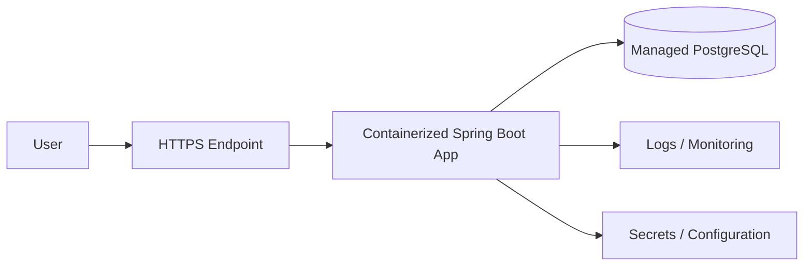

# 13 - AWS Cloud Plan

AWS is implemented in Week 11. Exact services are selected then because pricing/free tiers/product offerings can change.

## Required concepts
- compute/container hosting
- managed PostgreSQL
- VPC/networking basics
- DNS and HTTPS
- environment variables/secrets
- logs/basic monitoring
- cost awareness

## Logical architecture

## Deployment acceptance
- application reachable over HTTPS where practical,
- database not exposed unnecessarily,
- secrets not committed,
- migrations handled deliberately,
- logs available,
- smoke test documented,
- estimated/actual costs checked before leaving resources running.

Do not hard-code an AWS service choice in early weeks. Choose the simplest current option that demonstrates deployment without unnecessary complexity.
