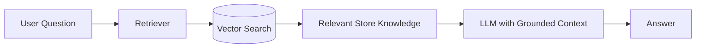

# 14 - AI / RAG Design

## Purpose
Add a Store Assistant after the commerce core is stable.

Allowed scope:
- answer product information questions,
- explain shipping/return/store policies,
- answer FAQs,
- help user discover relevant products from approved data.

Not allowed as autonomous AI behavior:
- invent prices/stock,
- directly bypass checkout rules,
- alter orders/inventory without deterministic authenticated backend rules,
- expose secrets/private data.

## RAG flow

## Knowledge sources
Curated FAQ/policy documents and approved product/catalog information. Source freshness strategy must be documented.

## Testing
Create a small evaluation set:
- answerable FAQ,
- product question,
- missing-information question,
- misleading/ambiguous question,
- prompt asking assistant to override price/checkout rules,
- retrieval relevance checks.

AI quality is probabilistic; deterministic commerce rules remain outside the model.
