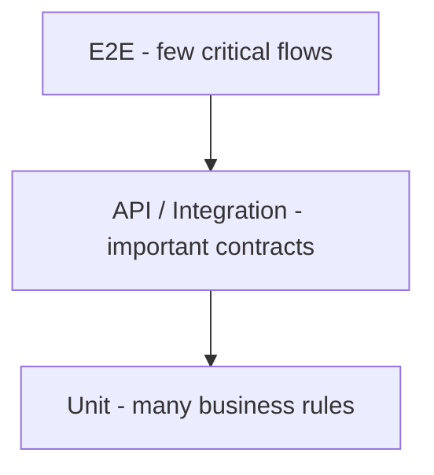

# Testing Strategy

## Goal
Use the cheapest test layer that gives confidence, while covering critical integrations and user journeys.

## Unit
JUnit 5 + AssertJ; Mockito where an external dependency should be isolated. Best for totals, coupon rules, state transitions, service decisions.

## Integration/API
Spring Boot Test + MockMvc or REST Assured; PostgreSQL via Testcontainers for database-sensitive behavior. Best for security, persistence mappings, transactions, HTTP contracts.

## E2E
Playwright against simple UI for a few valuable flows: login -> browse -> cart -> checkout -> order; admin flow as appropriate.

## Critical risks
- unauthorized access,
- wrong totals,
- invalid coupons,
- stock going negative,
- partial checkout commits,
- overselling under concurrency,
- invalid order transition,
- customer seeing another customer's data.
